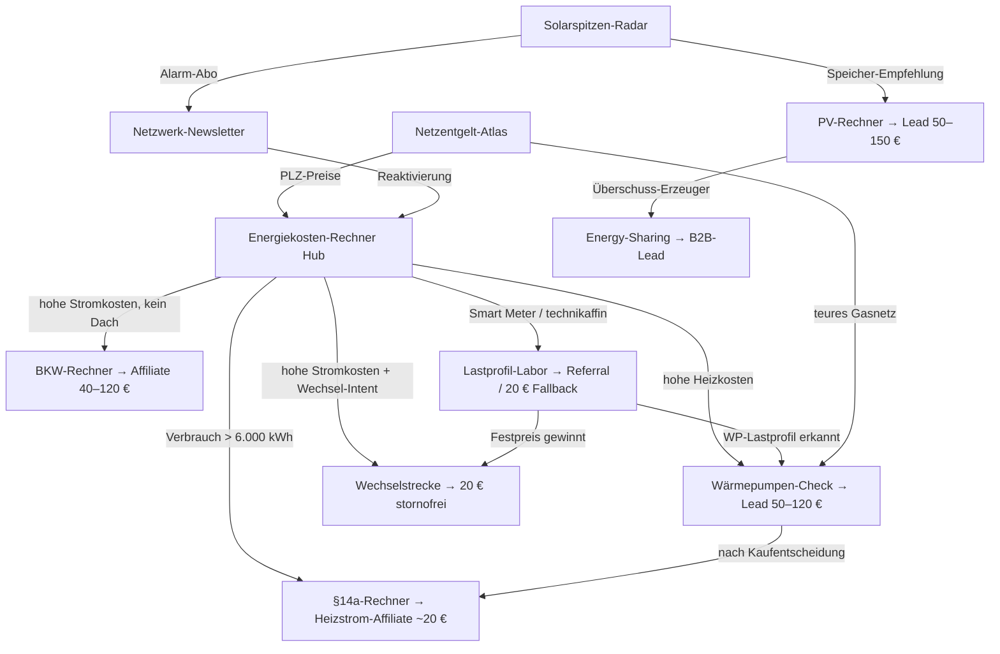

# Netzwerk-Architektur: Hub-and-Spoke auf einer Domain

## 1. Grundsatzentscheidung: Eine Domain

**Alle Projekte leben als Unterverzeichnisse einer Hub-Domain**, der bestehende Energiekosten-Rechner wird zum Hub (oder zieht per 301-Redirects auf die neue Hub-Domain um).

```
domain.de/                          ← Hub: Energiekosten-Rechner (bestehend)
├── /stromvergleich/                ← Phase 0: Check24-White-Label-Wechselstrecke
├── /14a-rechner/                   ← Phase 1: §14a-Modul-Rechner + WP-Strom-Vergleich
├── /waermepumpe/                   ← Phase 1: Vollkosten- & Förder-Check (+ BEG-Fördermodul)
├── /dynamische-tarife/             ← Phase 2: Lastprofil-Labor + Smart-Meter-Check
├── /solarspitzen-radar/            ← Phase 2: Negativpreis-Wächter
├── /energy-sharing/                ← Phase 2: §42c-Kompass (schlanke Wette)
├── /netzentgelte/                  ← Phase 3: Netzentgelt-Atlas (PLZ-Karte + Stadtseiten)
├── /widgets/                       ← Phase 3: Embed-Baukasten (Gratis-Tier)
├── /photovoltaik/                  ← Phase 3: PV-Rechner + Solar-Atlas (MaStR-Stadtseiten)
├── /balkonkraftwerk/               ← Phase 3: Speicher-Nachrüst-Rechner
└── /e-auto/                        ← nur Content: V2G-Keywords warmhalten, THG-Satellit
```

Begründung (siehe Marktanalyse §4): Domain-Cluster desselben Betreibers werden von Google als EIN Netzwerk behandelt und gemeinsam abgestraft (Doorway-Abuse); topische Autorität auf einer Domain ist der stärkste Ranking- und AI-Zitier-Hebel; jedes neue Tool zahlt sofort auf alle anderen ein.

## 2. Nutzerfluss: Jeder Besucher zur wertvollsten Monetarisierung

Der Hub diagnostiziert, die Spokes monetarisieren:



Kernprinzip: **derselbe Nutzer wird mehrfach monetarisiert** — z. B. Wärmepumpen-Käufer: erst Anschaffungs-Lead (50–120 €), dann Betriebskosten-Optimierung über §14a-/Tarif-Strecke (~20 €), dann Newsletter-Reaktivierung.

## 3. Geteilte Datenschichten (einmal bauen, vielfach nutzen)

| Datenschicht | Quellen | Versorgt | Aufwand |
|---|---|---|---|
| **Börsenpreis-Layer** | aWATTar (ohne Key, 1 gecachter Abruf/Tag), Fallback SMARD + energy-charts (CC BY 4.0) | Lastprofil-Labor, Solarspitzen-Radar, Widgets, E-Auto-Content | klein — zuerst bauen (Phase 2) |
| **MaStR-Pipeline** | Marktstammdatenregister-Gesamtexport (XML, täglich, dl-de/by-2-0; `open-mastr`) | Solar-Atlas-Stadtseiten, Netzentgelt-Atlas, Presse-Statistiken, Widgets | groß — erst Phase 3 |
| **Preis-/Netzentgelt-DB** | BNetzA-§23b-Excel (jährlich einlesen), Grundversorger-Preise, DEPI-Pelletpreis (monatlich manuell), Gas-Arbeitspreise | Hub (PLZ-genau), §14a-Modul-3, WP-Check, Netzentgelt-Atlas | mittel — inkrementell |
| **Ertrags-Layer** | PVGIS-API (frei, 30 Calls/s), DWD-Globalstrahlung (CC BY 4.0) | PV-Rechner, BKW-Rechner | klein |
| **Förder-DB (reduziert)** | BEG (Bund) + 16 Bundesländer, bewusst OHNE kommunale Tiefe | WP-Check-Fördermodul, BKW-Rechner, später Widget | klein halten! (Wartungsfalle) |

## 4. Geteilte Komponenten

- **Rechner-Framework:** Ein wiederverwendbares Kalkulations-UI (Eingabe-Steps, Ergebnis-Karte, teilbare Ergebnisgrafik, „Ergebnis vor Datenabfrage"-Muster) — jedes neue Tool ist Konfiguration statt Neubau.
- **Lead-/Affiliate-Routing:** Zentrale Weiche, die je nach Diagnose (PLZ, Verbrauch, Gebäudetyp) die passende Geld-Strecke ausspielt und Conversions pro Strecke misst (EPV-Tracking von Tag 1).
- **Netzwerk-Newsletter:** Ein Verteiler für alles („Energiepreis-Update"): Preisalarm, Fördertopf-Alerts, Negativpreis-Alarm, Wechsel-Erinnerung nach 11 Monaten. Owned Channel = Google-Unabhängigkeit. Vorbild Finanztip (37–39 % Öffnungsrate als Benchmark).
- **GEO-Baustein:** Jede Tool-Seite bekommt extrahierbare Zusammenfassung, aktuelle Zahlen mit Datum, FAQ-Block, Schema.org-Markup — für AI-Overview-Zitierungen (+35 % Klicks für Zitierte).

## 5. EEAT & Marke (Pflicht bei YMYL)

- Echtes Autorenprofil mit Namen und nachweisbarer Energie-Erfahrung auf jeder Seite; „Über uns" mit Betreiber-Story.
- **Methodik-Seite pro Rechner** („So rechnen wir": Formeln, Datenquellen BNetzA/Destatis/PVGIS, Aktualisierungsdatum) — differenziert gegen anonyme Affiliate-Seiten und ist selbst zitierfähig.
- Offene Rechenmodelle (Akkudoktor-Muster) als Vertrauens-Differenzierer gegen Shop-Rechner.
- Affiliate-Transparenz-Hinweis konsequent; Impressum/Datenschutz sauber (Abmahn-Prävention).
- Die Betreiber-Person als Entität aufbauen: Gastbeiträge, Forenpräsenz unter echtem Namen, Zitate in Fachmedien.

## 6. Technik-Empfehlung

- **Frontend:** Statisch generiert (z. B. Astro oder Next.js SSG) — Rechner als Inseln clientseitig. Schnell, günstig, SEO-stark.
- **Rechenlogik clientseitig wo möglich** — besonders das Lastprofil-Labor: Smart-Meter-CSV **im Browser parsen** (DSGVO: sensible Verbrauchsdaten verlassen das Gerät nicht — zugleich Marketing-Argument „deine Daten bleiben bei dir").
- **Daten-Backend:** Cron-Jobs (täglich Börsenpreise cachen, MaStR-Delta) + eine kleine DB/KV-Schicht; Edge-Hosting (z. B. Cloudflare Workers/Pages + D1/KV oder Supabase) reicht für alles bis weit in Phase 3.
- **Widgets:** iframe/Script-Embed mit Brand-Attributions-Link (kein optimierter Ankertext — Linkschema-Risiko).
- **Analytics:** Cookieless (z. B. Plausible/Umami) + serverseitiges Conversion-Tracking pro Geld-Strecke (EPV je Spoke ist DIE Steuerungskennzahl).

## 7. Rechtliche Leitplanken

- Reine Informations-/Vergleichs-/Tool-Angebote — keine Energieberatung im Rechtssinn, keine „rechtssicher"-Versprechen.
- Lastprofil-Daten: clientseitige Verarbeitung bevorzugen; wenn serverseitig, dann Löschkonzept + AVV.
- Förderdaten immer mit Stand-Datum und „ohne Gewähr, Programme können ausgeschöpft sein".
- Affiliate-Kennzeichnung auf jeder Seite mit Provisions-Links.
